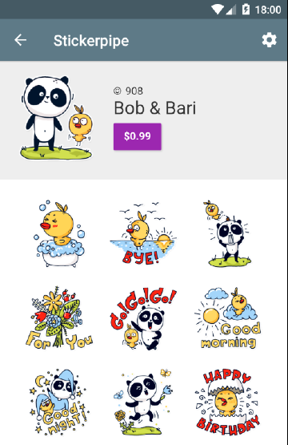

## Migration guide from pre 0.11.0 version
- Change KeyboardHandleLayout to StickersKeyboardLayout
- Create instance of StickersKeyboardController and pass all necessary arguments(see [Showing stickers fragment](#showing-stickers-fragment))
- Now you can remove all clicks handlings from stickers buttons, icon changing, keyboard size listeners, etc. All this work will be doing by controller.

## Table of contents

- [About](#about)
- [Installation](#installation)
- [Usage](#usage)
	- [Initializing](#initializing)
	- [Showing stickers fragment](#showing-stickers-fragment)
	- [Sending stickers](#sending-stickers)
	- [Displaying stickers](#displaying-stickers)
	- [Showing pack info](#showing-pack-info)
	- [Showing new packs marker](#showing-new-packs-marker)
- [Users](#users)
- [Search](#search)
	- [Search tab](#search-tab)
	- [Inline search](#inline-search)
- [Selling content](#selling-content)
	- [InApp purchases](#inapp-purchases)
	- [Internal currency](#internal-currency)
	- [Subscription model](#subscription-model)
- [GCM Support](#gcm-support)
	- [GCM integration module](#gcm-integration-module)
	- [Own GCM implementation](#own-gcm-implementation)
- [Customization](#customization)
	- [Emoji](#emoji)
	- [Colors](#colors)
	- [Languages](#languages)
- [Statistics](#statistics)
	- [Messages and stickers count](#messages-and-stickers-count)
- [Issues](#issues)
- [Credits](#credits)
- [Contact](#contact)
- [License](#license)

## About

**Stickerpipe** is a stickers SDK for Android platform.
This sample demonstrates how to add stickers to your chat. If you want to build your own implementation, you can use our [public api](https://docs.google.com/document/d/1l0IZOSEZn1qzhCen4-YzlwnXL4xYHndNcE3xyGYvPrg/edit#heading=h.smt8analmeuq).


## Installation

If you use Eclipse IDE - follow [this instructions](https://github.com/908Inc/stickerpipe-android-sdk-for-eclipse).

Add stickers repository in build.gradle:
```android
repositories {
   maven { url  'http://maven.stickerpipe.com/artifactory/stickerfactory' }
}
```
Add library dependency in build.gradle:
```android
compile('vc908.stickers:stickerfactory:x.x.x@aar') {
     transitive = true;
}
```
List of available versions you can find [here](http://maven.stickerpipe.com/artifactory/stickerfactory/vc908/stickers/stickerfactory/)

Add content provider with your application package to manifest file:
```android
<provider
     android:name="vc908.stickerfactory.provider.StickersProvider"
     android:authorities="<YOUR PACKAGE>.stickersProvider"
     android:exported="false"/>
```

## Usage

### Initializing

Initialize library at your Application onCreate() method
```android
StickersManager.initialize(“YOUR-API-KEY", this);
```
You can get your own API Key on http://stickerpipe.com to have customized packs set.

### Showing stickers fragment
We created some additional classes, to help you integrate stickers keyboard naturally to your app.
You still can simply create StickersFragment and use them, but we recommend our approach with StickersKeyboardController. This will make your integration more simple and give users more positive experience. See example for more details.

First of all, you need to create layout with following structure

```xml
<vc908.stickerfactory.ui.view.StickersKeyboardLayout
    android:id="@+id/sizeNotifierLayout"
    xmlns:android="http://schemas.android.com/apk/res/android"
    xmlns:app="http://schemas.android.com/apk/res-auto"
    android:layout_width="match_parent"
    android:layout_height="match_parent">

    <RelativeLayout
        android:id="@+id/chat_content"
        android:layout_width="match_parent"
        android:layout_height="match_parent">

      <!-- YOR CONTENT -->


            <vc908.stickerfactory.ui.view.BadgedStickersButton
                android:id="@+id/stickers_btn"
                android:layout_width="@dimen/material_48"
                android:layout_height="@dimen/material_48"
                android:background="?android:attr/selectableItemBackground"/>

        </RelativeLayout>
    </RelativeLayout>

    <FrameLayout
        android:id="@+id/frame"
        android:layout_width="match_parent"
        android:layout_height="240dp"
        android:layout_alignParentBottom="true"
        android:visibility="gone"/>
</vc908.stickerfactory.ui.view.StickersKeyboardLayout>

```
- Your layout need to be wrapped into StickersKeyboardLayout, for handling keyboard visibility changes.
- Your content need to be placed in a ReleativeLayout near frame for stickersFragment
- You need to use BadgedStickersButton as button for showing and hiding stickers keyboard.

Then, at your activity, you need to do next steps
- Create StickersFragment instance and place it to frame
```Android
	stickersFragment = new StickersFragment();
            getSupportFragmentManager().beginTransaction().replace(R.id.frame, stickersFragment).commit();
```
- Create StickersKeyboardController and pass necessary items
```Android
stickersKeyboardController = new StickersKeyboardController.Builder(this)
                .setStickersKeyboardLayout(stickersLayout) // parent layout
                .setStickersFragment(stickersFragment) // stickers fragment
                .setStickersFrame(stickersFrame) // frame for stickers
                .setContentContainer(chatContentGroup) // your content layout
                .setStickersButton(stickerButton) // stickers button
                .setChatEdit(editMessage) // edit text from chat
                .build();
```
- Add functionality for hiding stickers keyboard
```Android
@Override
public void onBackPressed() {
		if (!stickersKeyboardController.hideStickersKeyboard()) {
				super.onBackPressed();
		}
}
```

- If you want listen visibility changes of keyboards(soft and stickers), you can add own listener
```Android
stickersKeyboardController.setKeyboardVisibilityChangeListener(new StickersKeyboardController.KeyboardVisibilityChangeListener() {
		@Override
		public void onTextKeyboardVisibilityChanged(boolean isVisible) {
				// your code
		}

		@Override
		public void onStickersKeyboardVisibilityChanged(boolean isVisible) {
			// your code
		}
});
```

If you wan to hide soft keyboard, you can use KeyboardUtils
```Android
	KeyboardUtils.hideKeyboard(yourContext, someView);
```

### Sending stickers

To send stickers you need to set listener and handle results
```android
// create listener
private OnStickerSelectedListener stickerSelectedListener = new OnStickerSelectedListener() {
		@Override
		public void onStickerSelected(String code) {
				// send message
		}

		@Override
		public void onEmojiSelected(String emoji) {
				// append emoji to edit
		}
};
// set listener to your stickers fragment
stickersFragment.setOnStickerSelectedListener(stickerSelectedListener)
```

Listener can take an emoji, so you need to check code first, and then send sticker code or append emoji to your edittext.

### Displaying stickers

```android
// Show sticker in adapter
if (StickersManager.isSticker(message)){ // check your chat message
StickersManager.with(context) // your context - activity, fragment, etc
        .loadSticker(message)
        .into((imageView)); // your image view
} else {
	// show a message as it is
}
```

### Showing pack info

You can show pack info with next code
```android
 StickersManager.showPackInfoByCode(context, stickerCode);
```


### Showing new content marker

You can use BadgedStickersButton to indicate to user, that he has a new content
```android
            <vc908.stickerfactory.ui.view.BadgedStickersButton
                android:id="@+id/stickers_btn"
                android:layout_width="@dimen/material_48"
                android:layout_height="@dimen/material_48"
                android:layout_centerVertical="true"
                android:background="?android:attr/selectableItemBackground"/>
```
  

## Users

When you know your user id, set it to sdk   

```Android
StickersManager.setUserID("some unique user id");
```
This add ability to make purchases, manage their packs and don't lose them after reinstalling.  
You can obfuscate user id before setting it to sdk using md5 method from our Utils class
```Android
StickersManager.setUserID(vc908.stickerfactory.utils.Utils.md5("some unique user id, email, etc"));
```

Also you can send user related data, such as age or gender
```Android
Map<String, String> userData = new HashMap<>();
userData.put(User.KEY_GENDER, User.GENDER_MALE);
userData.put(User.KEY_AGE, String.valueOf(30));

StickersManager.setUser("some unique user id", userData);
```
## Search

Your users have an ability to search stickers by keywords using search tab or inline search.
Make sure, you are using StickersKeyboardController for managing your layouts for better integration.

### Search tab

By default, search tab is enabled in sdk, but you can disable this tab by passing flag at your application class
```Android
StickersManager.setIsSearchTabEnabled(false);
```

### Inline search

To add inline stickers search to your chat, follow next steps

- Place RecyclerView above your chat Edittext
```xml
<android.support.v7.widget.RecyclerView
            android:id="@+id/suggests_list"
            android:layout_width="match_parent"
            android:layout_height="@dimen/sp_suggest_container_height"
            android:layout_above="@+id/sender_section"/>
```
- Pass this view to StickersKeyboardController at your Activity
``` Android
StickersKeyboardController.Builder.create(this)
...
.setSuggestContainer(suggestsList)
.build();
```


## Selling content
You have an ability to sell content via your internal currency, inApp purchases or provide via subscription model. We use price points for selling our content. Currently we have A, B and C price points. We use A to mark FREE content and B/C for the paid content. Basically B is equal to 0.99$ and C equal to 1.99$ but the actual price can be vary depend on the countries and others circumstances.



### InApp purchases
To sell content via inApp purchases, you need to create products for B and C content at your developer console and then set SKU ids to sdk
```Android
StickersManager.setPrices(new Prices()
                .setSkuB("pack_b")
                .setSkuC("pack_c")
				);
```
### Internal currency
To sell content via internal currency, you need to set your prices to sdk. This price labels will be showed at stickers shop, values you will received at callback from shop.
```Android
StickersManager.setPrices(new Prices()
                .setPricePointB("$0.99", 0.99f)
                .setPricePointC("$1.99", 1.99f)
                );
```
Next you need to extend ShopWebViewActivity and implement onPurchase method. At this method you will receive all nececcary information.
```Android
public class ShopActivity extends vc908.stickerfactory.ui.activity.ShopWebViewActivity {
    @Override
    protected void onPurchase(String packTitle, final String packName, PricePoint pricePoint) {
        // Your charging logic
    }
}
```
After successful or failed(canceled) purchasing, you need to call necessary methods
```Android
// Successfully purchased pack
 StickersManager.onPackPurchased(packName);

 // Canceled of failed purchasing
 // This method from ShopWebViewActivity
  onPurchaseFail();
```
At last, you need to set your custom class to sdk
```Android
StickersManager.setShopClass(ShopActivity.class);
```

### Subscription model
If you want to use subscription model, you need to set subscription flag to sdk, when user became or ceased to be subscriber(or premium user). After this, content with B price point be available for free for subscribers(premium users)
```Android
StickersManager.setUserSubscribed(true);
```

## GCM Support

You have an ability to add push notifications to sdk. There are two ways - use GcmIntegration module or use own notification system

### GCM integration module

If your application don't have gcm functionality you need to follow next steps   

- Add dependency at your build file. List of available versions you can find [here](http://maven.stickerpipe.com/artifactory/stickerfactory/vc908/stickers/gcmintegration/)
```android
    compile('vc908.stickers:gcmintegration:x.x.x@aar'){
        transitive = true;
    }
```   

- Add receiver at your Manifest file and replace yor_package_name with your real package name
```android
 <receiver
            android:name="com.google.android.gms.gcm.GcmReceiver"
            android:exported="true"
            android:permission="com.google.android.c2dm.permission.SEND" >
            <intent-filter>
                <action android:name="com.google.android.c2dm.intent.REGISTRATION" />
                <action android:name="com.google.android.c2dm.intent.RECEIVE" />
                <category android:name="yor_package_name" />
            </intent-filter>
        </receiver>
```
- Retrieve Android GCM API key and store them   
Follow [this link](https://developers.google.com/mobile/add) and setup your application to obtain GCM API key. Next follow to your [admin panel](http://stickerpipe.com/cp), press "Manage" and store key.


- From previous step, receive sender id and set it to GcmManager at Application class
```Android
GcmManager.setGcmSenderId(mContext, "YOUR SENDER ID");
```
- Implement NotificationManager, where need to define start intent for notification and icons. For pre KitKat version, we use color notification icon and monochrome(black and white) for others.

```Android
public class PushNotificationManager extends vc908.stickerpipe.gcmintegration.NotificationManager {

    @Override
    public int getColorNotificationIcon() {
        return R.drawable.ic_launcher;
    }

    @Override
    public int getBwNotificationIcon() {
        return R.drawable.ic_notification;
    }

    @NonNull
    @Override
    public Intent createNotificationIntent(Context context) {
        return new Intent(context, MainActivity.class);
    }
}
```
- Set this manager at Application class
```Android
GcmManager.setPushNotificationManager(new PushNotificationManager());
```
- Add processing of intent at your activity class

```Android
	@Override
    protected void onCreate(Bundle savedInstanceState) {
        super.onCreate(savedInstanceState);
        ...
        checkIntent(getIntent());
    }
	@Override
    protected void onNewIntent(Intent intent) {
        super.onNewIntent(intent);
        checkIntent(intent);
    }

	private void checkIntent(Intent intent) {
		NotificationManager.processIntent(this, intent, stickersKeyboardController));
	}
```

For better push handling, we recommend to set android:launchMode="singleInstance" to your activity.		

### Own GCM implementation

If you have own GCM implementation, follow next steps   

- Go to your [admin panel](stickerpipe.com/cp), press "Manage"  and store your GCM API key
- Set sender id to GcmManager at Application class   
```android
GcmManager.setGcmSenderId(mContext, "YOUR SENDER ID");
```
- Implement NotificationManager, where need to define start intent for notification and icons. For pre KitKat version, we use color notification icon and monochrome(black and white) for others.

```Android
public class PushNotificationManager extends vc908.stickerpipe.gcmintegration.NotificationManager {

    @Override
    public int getColorNotificationIcon() {
        return R.drawable.ic_launcher;
    }

    @Override
    public int getBwNotificationIcon() {
        return R.drawable.ic_notification;
    }

    @NonNull
    @Override
    public Intent createNotificationIntent(Context context) {
        return new Intent(context, MainActivity.class);
    }
}
```
- Set this manager at Application class
```Android
GcmManager.setPushNotificationManager(new PushNotificationManager());
```
- When you receive GCM token, set it to SDK
```android
StickersManager.sendGcmToken("GCM TOKEN");
```
- When you receive notification, try to process it with GcmManager first
```android
if(!GcmManager.processPush(this, data)){
	// its not stickerpipe push, implement own processing
}
```

## Customization

### Emoji

You can replace native emoji with your custom images. You need to pass map of your codes with assosiated image name, wich can be placed at drawable or assets folders.
As emoji code, you can use utf8 symbols or your custom string. This code will be return to you at callback.
As param, you need to put resource location - DRAWABLE or ASSETS, and assets folder if need
```Android
// In your application after initializing sdk
LinkedHashMap<String, String> map = new LinkedHashMap<>();
map.put(Emoji.newString(0x1f496), "emoji_1f496"); // use emoji code
map.put("your_custom_string", "emoji_1f601"); // custom string as code
...
EmojiSettingsBuilder builder = new EmojiSettingsBuilder()
       .setCustomEmojiMap(map)
       .setResourceLocation(EmojiSettingsBuilder.EmojiResourceLocation.DRAWABLE); // or ASSETS
       // .setAssetsFolder("/your/asset/folder") for assets if need
       
StickersManager.setEmojiSettingsBuilder(builder);
```

### Colors

You can customize all colors by overriding values with "sp_" prefix.
```xml
<color name="sp_primary">#5E7A87</color>
<color name="sp_primary_dark">#455A64</color>
<color name="sp_primary_light">#CFD8DC</color>

<color name="sp_placeholder_color_filer">@color/sp_primary_light</color>
<color name="sp_toolbar_bg">@color/sp_primary</color>
<color name="sp_stickers_tab_bg">@color/sp_primary</color>
<color name="sp_stickers_backspace">@color/sp_primary</color>
<color name="sp_stickers_tab_strip">@android:color/white</color>
<color name="sp_stickers_list_bg">@android:color/white</color>
<color name="sp_stickers_tab_icons_filter">@android:color/white</color>
<color name="sp_stickers_empty_text">@color/sp_primary</color>
<color name="sp_stickers_empty_image_filter">@color/sp_primary</color>
<color name="sp_remove_icon">#616161</color>
<color name="sp_reorder_icon">#9e9e9e</color>

<color name="sp_primary_text">@android:color/black</color>
<color name="sp_secondary_text">#616161</color>

<color name="sp_list_item_pressed">#ffe1e1e1</color>
<color name="sp_list_item_normal">@android:color/white</color>
<color name="sp_red_500">#F44336</color>
<color name="sp_notification_icon_background">@color/sp_primary</color>

<color name="sp_tab_badge_center">@android:color/white</color>
<color name="sp_tab_badge_inner">@color/sp_red_500</color>
<color name="sp_tab_badge_outer">@color/sp_primary</color>

<color name="sp_button_badge_center">@android:color/white</color>
<color name="sp_button_badge_inner">@color/sp_red_500</color>
<color name="sp_button_badge_outer">@android:color/white</color>

<color name="sp_pack_info_message_text">@color/sp_primary</color>
<color name="sp_pack_info_message_image_filter">@color/sp_primary</color>
<color name="sp_pack_info_bg">@android:color/white</color>
```

### Languages

Stickerpipe SDK support English language. If your application use another languages, you need add translation for next values
```xml
<string name="sp_package_stored">Pack stored</string>
<string name="sp_package_removed">Pack removed</string>
<string name="sp_collections">Collections</string>
<string name="sp_recently_empty">We have wonderful stickers!\nSwipe left and start using</string>
<string name="sp_pack_info">Pack info</string>
<string name="sp_pack_download">Download</string>
<string name="sp_pack_remove">Remove pack</string>
<string name="sp_no_internet_connection">No internet connection</string>
<string name="sp_cant_process_request">Can not process request</string>
<string name="sp_content_is_unavailable">This content is currently\nunavailable</string>
<string name="sp_open_stickers">Open stickers</string>
<string name="sp_shop">Shop</string>
<string name="sp_tab_new">New</string>
<string name="sp_tab_top">Top</string>
<string name="sp_tab_free">Free</string>
<string name="sp_free">Free</string>
<string name="sp_shop_packs_list_promo_title" formatted="false">%s %s</string>
<string name="sp_activate">Activate</string>
<string name="sp_subscription_text">Send emotions with original Stickers! Available on premium status.</string>
<string name="sp_undo">Undo</string>
<string name="sp_reload">Reload</string>
<string name="sp_download">Download</string>
```
## Statistics

### Messages and stickers count
To count the number of sending messages and stickers, you need call an analysts method onUserMessageSent (boolean)
```Android
AnalyticsManager.getInstance().onUserMessageSent(StickersManager.isSticker(message));
```
Call this method when a user sent a message

## Issues

If you are using TabLayout from design library, check this [issue](https://code.google.com/p/android/issues/detail?id=201827)

## Credits


Stickerpipe

## Contact


i@stickerpipe.com

## License


Stickerpipe is available under the Apache 2 license. See the [LICENSE](LICENSE) file for more information.
